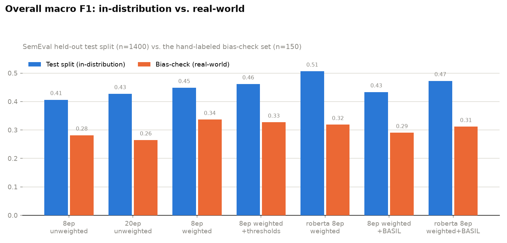
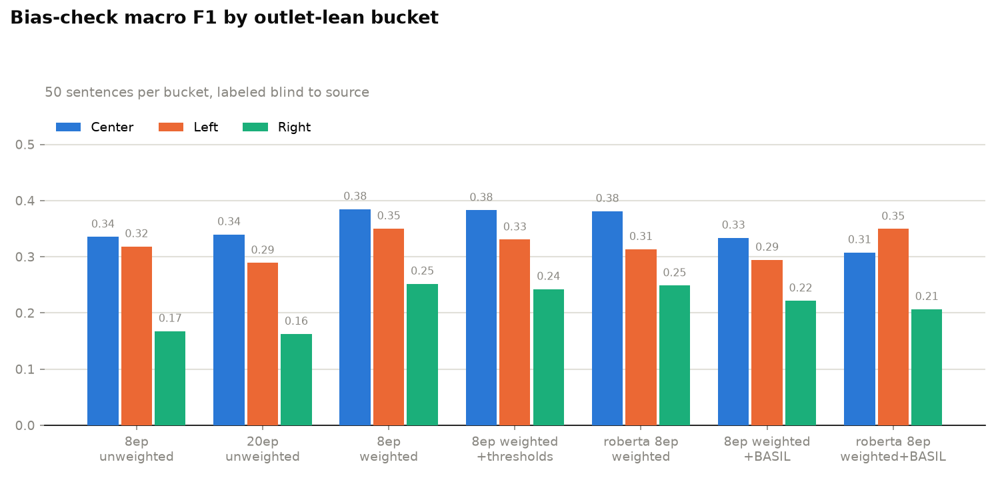
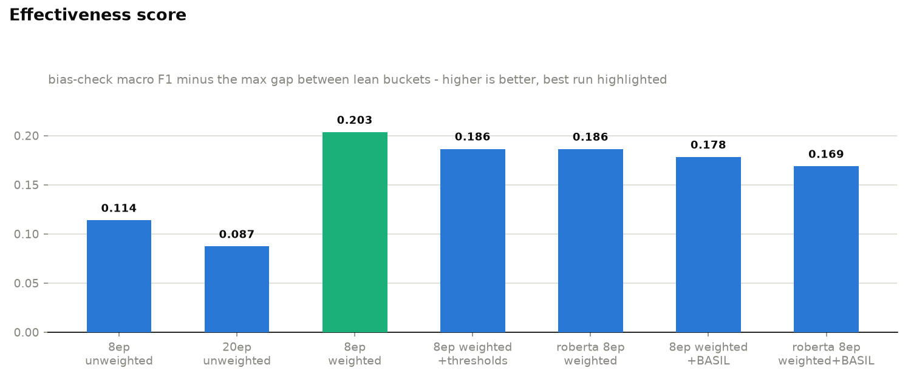
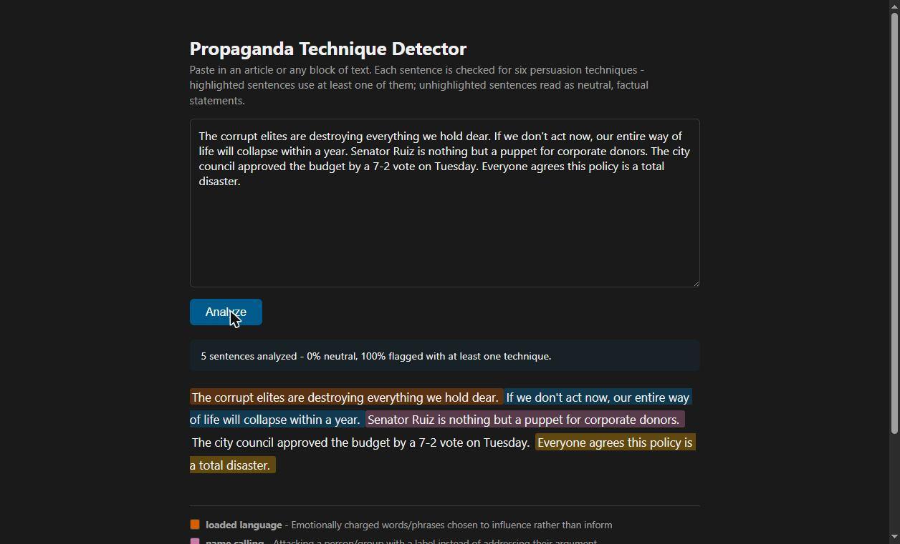

# Propaganda Technique Detector

[](https://github.com/imbad321/propaganda-technique-classifier/actions/workflows/ci.yml)

I built this to see whether I could take a real, honest crack at a problem that most
"propaganda detector" side projects get wrong: they train on which *outlet* published
a sentence rather than what the sentence actually *says*, which just teaches a model
to fingerprint a publication's writing style instead of detecting the rhetorical
technique. I wanted to build something that judges text on its content, and then
actually go verify that it does that, rather than assume it.

I'm Ibad Khan, a math and comp sci major, and this was my attempt at doing that
properly: a multi-label sentence classifier for six persuasion techniques, a
purpose-built methodology for catching source bias, and a small Flask app to serve
it.

## Labels

A sentence can carry zero, one, or several of these at once - it's multi-label, not
a single category pick.

| Label | Meaning |
|---|---|
| `loaded_language` | Emotionally charged words/phrases chosen to influence rather than inform |
| `name_calling` | Attacking a person/group with a label instead of addressing their argument |
| `exaggeration_minimization` | Overstating or understating something's importance or scale |
| `appeal_to_fear` | Framing built around provoking fear or alarm rather than evidence |
| `unsupported_claim` | An assertion presented as fact with no evidence or citation |
| `factual_neutral` | Sentence presents verifiable information without rhetorical framing |

## The bias problem this is built around

If you train on "everything Outlet X publishes is propaganda," the model learns
Outlet X's style, not the technique. So I only trained on
[SemEval-2020 Task 11](https://zenodo.org/records/3952415), where propaganda
technique spans were annotated by humans reading the text itself, sentence by
sentence - not inherited from the source.

To actually check whether that goal held up in practice, I built a second,
completely separate evaluation: 150 real sentences pulled evenly across
left/center/right-leaning outlets (50 each), which I hand-labeled myself *blind to
which outlet each sentence came from*, using `label_tool/` (a small app I built for
exactly this - add sentences, then label them one at a time with the outlet/lean
hidden). If the trained model performs very differently across the three lean
buckets, that's evidence it picked up something about outlet style rather than the
technique itself.

## Project structure

```
labels.py                    Label schema + SemEval technique -> label mapping
data/
  prepare_semeval.py         Downloads SemEval-2020 Task 11, builds train/val/test
  prepare_basil.py           Optional: adds BASIL (Fox/NYT/HuffPost bias spans)
  build_bias_check_set.py    CLI/spreadsheet alternative to label_tool/
  bias_check/                entries.json, bias_check_set.jsonl, agreement.py
label_tool/                  Standalone app: add + blind-label bias-check sentences
train.py                     Fine-tunes the transformer
evaluate.py                  Test-split F1 + per-lean bias-check F1 + effectiveness score
tune_thresholds.py           Per-label decision threshold tuning (no retraining)
inference.py                 Sentence splitting + batch prediction, used by app.py
app.py                       Flask app (GET /, POST /predict)
templates/, static/          Frontend for the app
results/                     Every experiment's saved metrics
tests/                       Unit tests (labels, inference, evaluate, app routes)
```

## Setup

```bash
python -m venv .venv
source .venv/Scripts/activate   # Windows: .venv\Scripts\activate
pip install -r requirements.txt
```

`requirements.txt` is pinned to exact versions that this project is tested against. For development
(running the test suite), use `pip install -r requirements-dev.txt` instead, which adds `pytest`.

If you have an NVIDIA GPU, check `nvidia-smi` for your CUDA version and install the
matching torch build - plain `pip install torch` gets you a CPU-only wheel on
Windows, and the difference is not small (I measured roughly 3.5 hours vs. 5
minutes for the same training run):

```bash
pip uninstall torch
pip install torch --index-url https://download.pytorch.org/whl/cu126
```

## 1. Build the training data

```bash
python data/prepare_semeval.py
```

Downloads the SemEval-2020 Task 11 archive, maps its 14 fine-grained propaganda
techniques onto my 6 labels (see `labels.TECHNIQUE_TO_LABEL` - several techniques
with no clean home, like whataboutism and thought-terminating clichés, collapse into
`unsupported_claim` since they share the same "claim pushed without evidence"
property), and splits at the *article* level so no article's writing style leaks
across train/val/test.

```
Built 15610 sentence-level examples from 371 articles.
  loaded_language: 1879      name_calling: 934        exaggeration_minimization: 456
  appeal_to_fear: 334        unsupported_claim: 2237  factual_neutral: 10878
train: 12607   val: 1603   test: 1400
```

`factual_neutral` dominates, which is realistic for real news text but means macro
F1 (not accuracy or micro F1) is the metric to trust - it weights every label
equally instead of letting the common label hide bad performance on the rare ones.

Optionally, `python data/prepare_basil.py` adds ~7,700 more sentences from
[BASIL](https://github.com/launchnlp/BASIL) (100 events x Fox News/NYT/HuffPost,
each annotated for bias spans, not outlet-level labels) as an additional,
non-default training source - pass `--extra-train data/processed/basil.jsonl` to
`train.py` to include it. (BASIL's repo ships no license file and contains
copyrighted article text - local research use only.)

## 2. Build the bias-check set

```bash
python label_tool/app.py
```

Visit `http://127.0.0.1:5001`. Three screens: **Add** a sentence (or paste many as
CSV) with its outlet and lean; **Label** shows one sentence at a time as a
click-through card (press 1-6 to toggle a label, Enter to save and move on) with the
outlet/lean deliberately never sent to that screen; **Export** writes every labeled
sentence to `data/bias_check/bias_check_set.jsonl`, which `evaluate.py` reads
directly.

## 3. Train

```bash
python train.py --epochs 8
```

Fine-tunes `distilbert-base-uncased` with `problem_type="multi_label_classification"`
(independent sigmoid + BCE loss per label, not one softmax, since sentences can
carry multiple labels). Class-weighted loss is on by default - a missed
`appeal_to_fear` sentence costs the model more than a missed `factual_neutral` one,
scaled by how rare each label actually is in training (up to 30x). Pass
`--loss-weighting none` to disable it, or `--base-model roberta-base` to swap the
base model.

## 4. Evaluate

```bash
python evaluate.py
```

Reports micro/macro F1 on the held-out test split, the same broken down by
outlet-lean bucket on the bias-check set, and an **effectiveness score**
(bias-check macro F1 minus the max gap between lean buckets) - a single number that
can't be gamed by being accurate but unevenly so.

## Results

I ran seven configurations to actually understand what moves the numbers, not just
to report the best one:

| Config | Test F1 macro | Bias-check F1 macro | Max lean gap | Effectiveness score |
|---|---|---|---|---|
| 8ep, unweighted (baseline) | 0.406 | 0.282 | 0.168 | 0.114 |
| 20ep, unweighted | 0.427 | 0.264 | 0.177 | 0.087 |
| 8ep, class-weighted | 0.448 | 0.336 | 0.133 | **0.203** |
| 8ep, class-weighted + tuned thresholds | 0.461 | 0.327 | 0.140 | 0.186 |
| 8ep, roberta-base, class-weighted | 0.506 | 0.319 | 0.132 | 0.186 |
| 8ep, class-weighted + BASIL data | 0.433 | 0.290 | 0.112 | 0.178 |
| 8ep, roberta-base, class-weighted + BASIL | 0.473 | 0.311 | 0.143 | 0.169 |





Regenerate these from the current `results/*.json` files with `python make_plots.py`.

What I actually learned from this, not just the numbers:

- **2.5x the training epochs (8 -> 20) barely moved test F1 and made the bias-check
  numbers worse.** More training was not the fix for the rare-label weakness or the
  lean gap - I checked, rather than assumed.
- **Class-weighted loss was the single biggest win**, on every axis at once,
  including narrowing the lean gap from 0.168 to 0.133. This is the one instance
  where a targeted fix under my control clearly worked.
- **A bigger base model (roberta-base) bought real accuracy (best test F1: 0.506)
  but didn't move the fairness gap at all.** Model capacity isn't the lever for that
  specific problem.
- **Adding BASIL's ~7,700 sentences narrowed the gap furthest of anything I tried
  (0.112) but cost raw accuracy** - its labels come from a different task (general
  lexical/informational bias, not this exact 6-label taxonomy), so it only
  contributes signal to 2 of the 6 labels while diluting the rest.
- **Stacking the two didn't stack the gains** - roberta-base trained on the combined
  SemEval+BASIL data (0.169) landed below either improvement on its own. Bigger
  model and more diverse data each helped a different axis but didn't compound.
- By the effectiveness score, **plain 8-epoch class-weighted distilbert is still the
  best model I trained** - bigger and fancier didn't win.

Current model in `model/`: 8-epoch, class-weighted `distilbert-base-uncased`.

| Label | Test F1 | Training support |
|---|---|---|
| `factual_neutral` | 0.842 | 10878 |
| `loaded_language` | 0.502 | 1879 |
| `unsupported_claim` | 0.367 | 2237 |
| `name_calling` | 0.439 | 934 |
| `exaggeration_minimization` | 0.276 | 456 |
| `appeal_to_fear` | 0.265 | 334 |

Performance tracks training support closely - `appeal_to_fear` and
`exaggeration_minimization`, the two rarest labels, are the weakest.

## Bias-check results

150 real sentences, hand-labeled blind to source, 50 per lean bucket.

| Bucket | n | F1 macro |
|---|---|---|
| Overall | 150 | 0.336 |
| `lean=center` | 50 | 0.385 |
| `lean=left` | 50 | 0.350 |
| `lean=right` | 50 | 0.252 |

There's a real gap - `right` scores meaningfully worse than `center` or `left`,
including on `factual_neutral` itself, which points more toward "this content is
stylistically harder for the model" than "the model is trained to over-flag one
side," but it's a real signal worth taking seriously, not a settled verdict either
way. Class-weighted loss narrowed this gap; more epochs and a bigger base model did
not.

**Overall bias-check macro F1 (0.336) is below the held-out SemEval test-split macro
F1 (0.448).** The model generalizes worse to independently-sourced real sentences
than to more of its own training distribution - a reminder that in-distribution test
numbers overstate real-world performance, and part of why I built the bias-check set
at all instead of trusting the SemEval split alone.

### Checking my own labels for annotator bias

Since the bias-check ground truth came from one person's judgment (mine), I had an
LLM (Claude) independently relabel the same 150 sentences blind - sentence text
only, no outlet, no lean, no access to my labels - against the same rubric, as a
second annotator. Mean per-label Cohen's kappa: **0.426** ("moderate" agreement on
the Landis-Koch scale), with real variation by label - `name_calling` and
`appeal_to_fear` agreed well, `exaggeration_minimization` barely agreed at all
(kappa 0.157, a 6x difference in how often each of us flagged it). That's a real
signal that "exaggeration/minimization" is harder to apply consistently than the
other labels, and it means the bias-check numbers above should be read with that
noise in mind - a different labeler would shift the absolute numbers somewhat,
though probably not the qualitative pattern, since it also shows up on the much
larger SemEval test split. It's a sanity check on label consistency, not a
replacement for a second human labeler with genuinely different priors, which would
be the stronger next step.

## 5. Run the app

```bash
python app.py
```

Visit `http://127.0.0.1:5000`. Paste text, click Analyze - each sentence gets
highlighted by its top predicted label, with a summary of % flagged vs. neutral.



`POST /predict` with `{"text": "..."}` returns:

```json
[
  {"sentence": "The corrupt elites are destroying everything we hold dear.",
   "labels": [{"name": "loaded_language", "score": 0.91}]},
  {"sentence": "The bill passed 218-210.", "labels": []}
]
```

## Tests

```bash
pip install -r requirements-dev.txt
pytest
```

Unit tests cover the parts of the pipeline that don't require a trained model or GPU: the
label schema and SemEval technique mapping, sentence splitting and threshold loading in
`inference.py`, the confusion-matrix and JSONL-loading helpers in `evaluate.py`, and the
Flask routes in `app.py` (with the model mocked out). They run in CI on every push via
`.github/workflows/ci.yml`. Training and evaluation against the real model are exercised
manually, not in CI, since the trained weights are too large to check in.

## Future: Chrome extension

The `/predict` API is intentionally the whole surface a Manifest V3 content script
would need: pull article text (e.g. via Readability.js), POST it, inject the same
color-coded spans into the page. No backend changes anticipated for that phase.

## Known limitations

- **The model is undertrained for production use** - 8 epochs on ~12.6k sentences
  from essentially one dataset. This was a project to build and honestly evaluate a
  full pipeline, not to chase state of the art.
- **Base-model bias is out of scope.** `distilbert-base-uncased`/`roberta-base` were
  pretrained by others on web/book text nobody audited for political balance - I
  have no practical way to inspect or retrain that. The bias-check catches the *net*
  effect of the whole pipeline on real behavior, which is the right tool for
  downstream symptoms, but it can't tell you whether a gap originated in
  pretraining, in SemEval's own article selection (its released files strip outlet
  metadata entirely, so I can't audit that either), or in fine-tuning.
- **The 14-to-6 technique mapping is lossy by design** - several distinct SemEval
  techniques share the `unsupported_claim` bucket.
- **150 sentences (50/lean) is a sanity check, not a statistically powered study.**
  The measured gap is real and worth taking seriously, not a settled verdict.
- **Closing the gap further needs more labeled data on this exact taxonomy** -
  epochs, threshold tuning, and base model size all plateaued quickly; only
  class-weighting and (partially) more diverse data moved it, and I ran out of
  runway on data collection for this pass.
